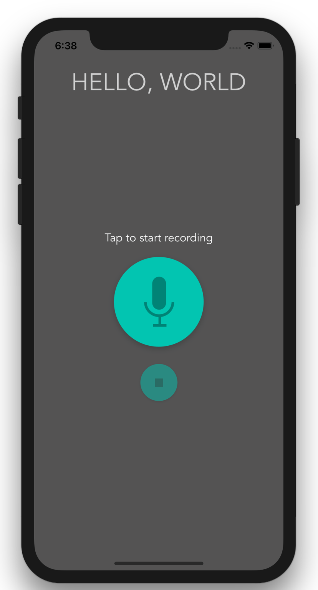
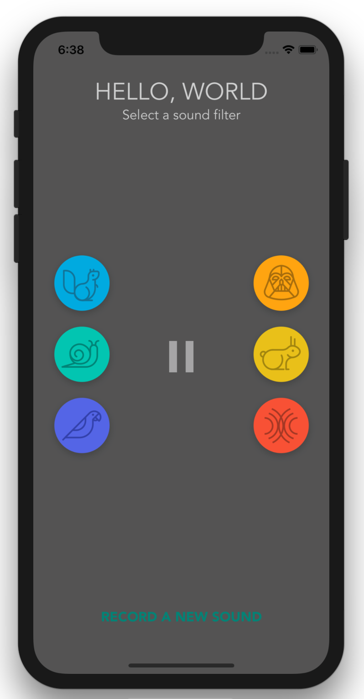

# Pitch Perfect iOS Application

This app was created as an Intro to iOS App Development with Swift lesson with Udacity. The app allows users to record a sound using the device’s microphone. It then allows users to play the recorded sound back with four different sound modulations: Chipmunk, Darth Vader, Slow, Fast with Reverb and Echo effect.

## Screenshots

 
